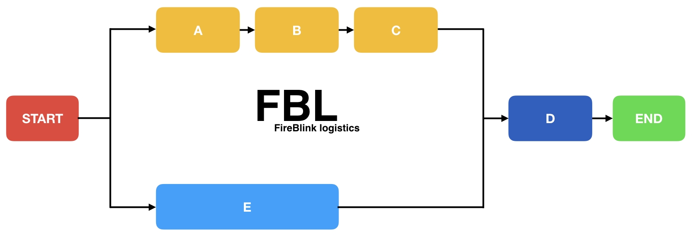

# FBL \(FireBlink Logistics\)

[](https://greenkeeper.io/)
[](https://circleci.com/gh/FireBlinkLTD/fbl)
[](https://codecov.io/gh/FireBlinkLTD/fbl)

This is a second reincarnation on internal tool that FireBlink LTD used to deploy its own projects.
Original tool was vendor locked and had pretty much limited functionality.

The new one, README of which you're currently reading is redesigned from scratch to fix that limitation.
Even more, due to plugin nature it can process any kind of flows, even non related to deployments. 

FBL generally designed to help with automation related tasks that require flexible control over the flow.

Here is how a very basic flow may FBL handle:



FBL can run steps "A" then "B" and "C" in a chain, but step "E" in parallel with that chain.
Once all are completed step "D" is invoked.

Out of the box FBL contains lots of default steps that can help to control the flow. 

# Usage

Flexibility is the key concept of the FBL, so it can be used either as a command line tool, or integrated into any
existing Node.js app.

FBL by its own just provides a generally limited amount of embedded plugins and for real life usage may require 3rd party plugins.

## Requirements

- Node.js v8+ (earlier version may also work, but not supported officially)

## Installation 

Just run `npm i -g fbl` to install the CLI.

## Flow file format

```yaml
# [optional] flow version, it is up to the user whether to use it or not
version: 1.0.0

# [optional] flow specific requirements 
requires:
  # [optional] fbl version requirements, value should conform with semantic versioning 
  fbl: >0.2.0
  
  # [optional] fbl plugins and their semantic versioning
  plugins: 
    - fbl.plugin.ftpo@^0.1.0
  
  # [optional] native application/commands presented in the PATH environment variable
  applications:
    - kubectl
    - helm

# [optional] flow description, it is up to the user whether to describe a flow in a human readable way
description: |-
  Plugn invoker.

# The starting point of the flow.
pipeline:
   # Pipeline may only have one key that represents action handler ID or one of its aliases
   # value is action handler specific, make sure to read corresponding documentation first  
   'plugin.id': 'plugin.options'
   
   # Metadata
   # Each action may have additional metadata associated with it
   # Naming convention: all metadata fields should start with dollar sign - $.
   # Action Ids or aliases could not start with $.   
   $title: 'Human readable title of action'
``` 

Flow files can use EJS [templates](docs/templates.md) for a flexible control over the flow.

## Default Plugins

- [Context](docs/plugins/context.md)
- [Exec](docs/plugins/exec.md)
- [Flow Control](docs/plugins/flow.md)
- [File System](docs/plugins/fs.md)
- [CLI Prompts](docs/plugins/prompts.md)
- [Execution Reporters](docs/plugins/reporters.md)

## Global Config

Create folder `.fbl` inside your user home directory. Put `config` file inside it with following format:

```yaml
# Provide a list of globally installed plugins or absolute paths
# Has same effect as "-p" option.
plugins:
  - fbl-plugin-name
  - /home/user/test/fbl-plugins/fbl-plugin-name
  
# Provide list of context key=value pairs
# Has same effect as "-c" option.
# Note: if you will provide just a key you will get prompted to provide a value each time you invoke the "fbl" cli
context:
  - key=value

# Provide list of secrets key=value pairs
# Has same effect as "-s" option.
# Note: if you will provide just a key you will get prompted to provide a value each time you invoke the "fbl" cli
secrets:
  - key=value

# Disable console colorful output
# Has same effect as "--no-colors" option
no-colors: true

# Custom global EJS template delimiter
global-template-delimiter: $

# Custom local EJS template delimiter
local-template-delimiter: %
```

## Packaging

You can also optionally package your flow (in a tarball) and reference it via file or url if it stored remotelly.

Read more about it [here](docs/tarball.md).