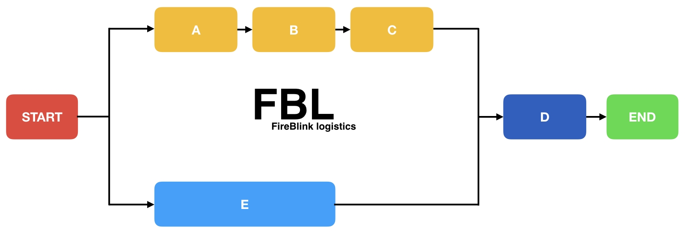

# FBL \(FireBlink Logistics\)

Swiss knife to start automate any kind of routine work.

## Target users and use cases:

- DevOps, as fbl can make the flow control deployment an easy task.
  We already use FBL to make K8s deployments.

- Developers, who need to automate their routine tasks.
  We use FBL to create CLI wizards to share with other teams to execute one time tasks on environments we have no direct access.

- Managers. We use FBL to gather time sheet reports from multiple sources to create monthly reports on user activities.

- Anyone who just wants to automate his routine work a bit.



FBL allows to write both simple and really complex scenarios, where tasks can be spread into different streams.
Streams can be executed in parallel and once all are done - another stream will start of proceed, depending on your needs.

## Plugin

FBL is not oriented to resolve just one particular thing, but to resolve any kind of automation task with reach set of plugins. By itself FBL exposes few handy plugins that can help you to start the automation flow. Plugins from FireBlink or any 3rd party developer can easily be integrated into your flows.

Found no suitable plugin? No problem - either create it yourself or contact us to create one for you.
We also open to help with writing automation scenarios of any kind and complexity. We provide a handy template to start with plugin development - [fbl-plugin-template](https://github.com/FireBlinkLTD/fbl-plugin-template)

You can read more about the default flows by following this [link](plugins/README.md).

### List of Official Plugins

#### General Purpose Plugins

- [@fbl-plugins/crypto](https://www.npmjs.com/package/@fbl-plugins/crypto) - Allows to encrypt/decrypt files. You may use this plugin to create secure vault inside your GIT repository with sensitive data, to help with that use [vault template](https://github.com/FireBlinkLTD/fbl-vault-flow-template)

- [@fbl-plugins/http](https://www.npmjs.com/package/@fbl-plugins/http) - Make any kind of HTTP request to integrate with REST APIs, upload and download files, etc.

- [@fbl-plugins/html-to-pdf](https://www.npmjs.com/package/@fbl-plugins/html-to-pdf) - Generate PDF file based on HTML template. You can use it to generate reports, invoices, etc.

- [@fbl-plugins/html-to-img](https://www.npmjs.com/package/@fbl-plugins/html-to-img) - Generate PNG/JPEG image based on HTML template.

#### K8s (Kubernetes) Plugins

- [@fbl-plugins/k8s-helm](https://www.npmjs.com/package/@fbl-plugins/k8s-helm) - Allows to manage helm releases.

- [@fbl-plugins/k8s-kubectl](https://www.npmjs.com/package/@fbl-plugins/k8s-kubectl) - Allows to execute kubectl commands (apply, delete, etc)

#### Others

- [@fbl-plugins/keycloak-admin-client](https://www.npmjs.com/package/@fbl-plugins/keycloak-admin-client) - Keycloak admin client integration to manage realm(s) from the FBL flow (clients, roles, etc).

Some of the plugins may not be listed here, but you can generally search NPM registry by following the [link](https://www.npmjs.com/search?q=fbl%20plugins).

## Packaging

Want to share your flow with others? No problem, just create a tarball (\*.tar.gz archive) with index.yml file inside and share with others.
Packaged flows can be used directly inside other flows or invoked via CLI (remote URLs are supported).

Even more, you can wrap the flow into "[virtual](plugins/flow.md#action-handler-virtual)" actions that allow to create plugin-like behavior with 0 coding.

## Requirements

FBL requires [Node.js](https://nodejs.org) to be installed on your system. We recommend to use latest LTS version.

## Installation

Just run following command in your terminal to install fbl:

```bash
npm i -g fbl
```

To get list of available CLI arguments run:

```bash
fbl --help
```

You can also provide global [default configuration](global-config.md) if you need to assign same options for all your flow's executions.

## Next steps

- Write your first flow. Check [this](flows/hello-world.md) for more details.
- Review default [plugins](plugins/README.md).
